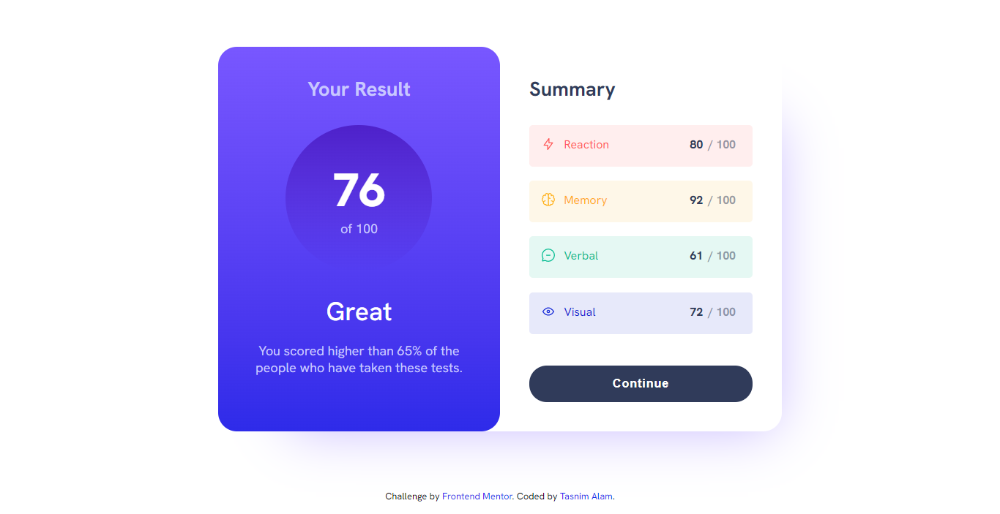

# Frontend Mentor - Results summary component solution

This is a solution to the [Results summary component challenge on Frontend Mentor](https://www.frontendmentor.io/challenges/results-summary-component-CE_K6s0maV).

## Table of contents

- [Overview](#overview)
  - [The challenge](#the-challenge)
  - [Screenshot](#screenshot)
  - [Links](#links)
- [My process](#my-process)
  - [Built with](#built-with)
  - [What I learned](#what-i-learned)
  - [Useful resources](#useful-resources)
- [Author](#author)

## Overview

### The challenge

Users should be able to:

- View the optimal layout for the interface depending on their device's screen size
- See hover and focus states for all interactive elements on the page

### Screenshot



### Links

- Solution URL: (https://github.com/Tasnim005/Results-summary-component)
- Live Site URL: (https://tasnim005.github.io/Results-summary-component/)

## My process

### Built with

- Semantic HTML5 markup
- Flexbox
- CSS Grid
- Fetch API

### What I learned
I learned the application of Fetch API and use of variable fonts.

```css
@font-face {
  font-family: "Hanken Grotesk Regular";
  src: url("assets/fonts/HankenGrotesk-VariableFont_wght.woff2") format("woff2");
  font-weight: 100 900;
  font-display: swap;
}
```
```js
fetch("data.json")
  .then((response) => response.json())
  .then((data) => {
    let sum = 0;
    for (let i = 0; i < data.length; i++) {
      sum += data[i].score;
    }
    const average = Math.floor(sum / data.length);
    console.log(average);
    avgMark.innerText = average;
  });

// Fetching icons from local JSON file
fetch('data.json')
  .then((response)=>response.json())
  .then((data)=>{
    iconElements.forEach((element, index)=>{
      element.innerHTML = ``
    })
  })

```

### Useful resources

- [Fetch API Introduction by Brad Traversy](https://www.youtube.com/watch?v=Oive66jrwBs&list=LL&index=3) - This tutorial from 'Traversy Media' helped me for learning Fetch API. 
- [Getting started with Variable fonts on the web](https://www.youtube.com/watch?v=0fVymQ7SZw0&list=LL&index=2) - Here, Kevin Powell helped me finally understand Variable fonts. I'd recommend it to anyone still learning this concept.

## Author

- Website - [Tasnim Alam](https://github.com/Tasnim005)
- Frontend Mentor - [@Tasnim005](https://www.frontendmentor.io/profile/Tasnim005)

